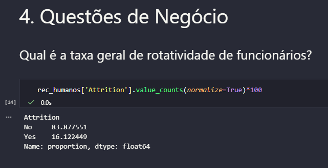
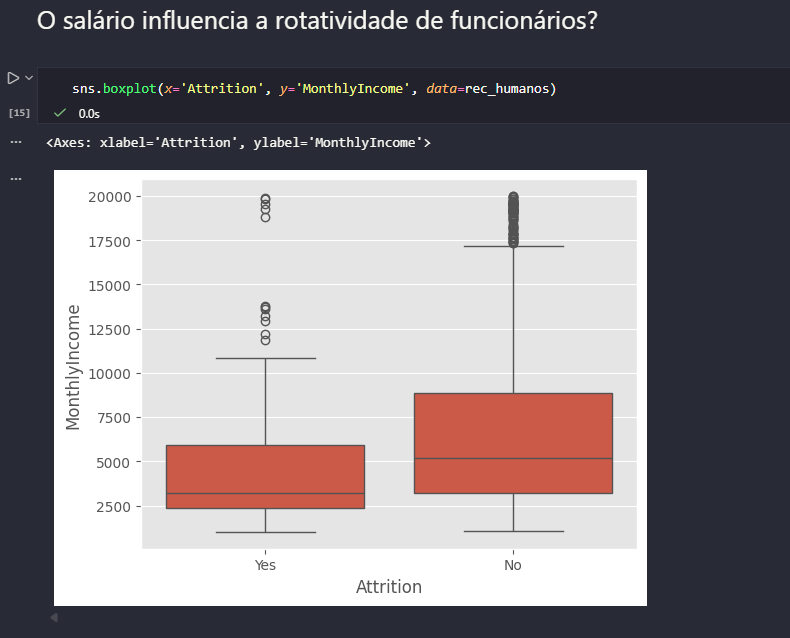
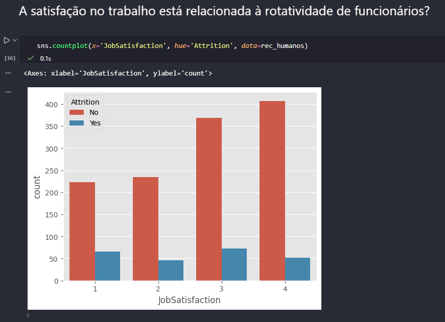
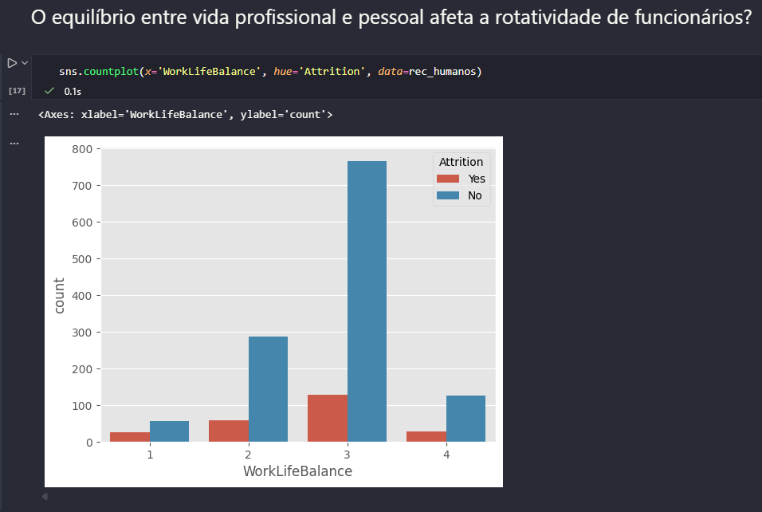

# Análise de Dados de Rotatividade de Funcionários (IBM HR Analytics)

📌 **Descrição**
Este projeto analisa um conjunto de dados de Recursos Humanos da IBM disponível no Kaggle (https://www.kaggle.com/datasets/pavansubhasht/ibm-hr-analytics-attrition-dataset).

O objetivo da análise é **investigar fatores que podem influenciar a rotatividade de funcionários (attrition)**, identificando padrões nos dados e gerando insights que possam ajudar na **retenção de talentos dentro da empresa**.

Os dados foram carregados a partir do arquivo **IBM-HR-Employee-Attrition.csv** e analisados utilizando **Jupyter Notebook no VS Code**.

---

🗂️ **Estrutura do Projeto**

1️⃣ **Introdução** – Contextualização do problema e apresentação da fonte de dados.
2️⃣ **Carregamento de Bibliotecas** – Importação das bibliotecas utilizadas na análise.
3️⃣ **Carregamento e Exploração Inicial dos Dados** – Leitura do arquivo CSV e análise inicial do dataset.
4️⃣ **Questões de Negócio** – Investigação de perguntas relevantes relacionadas à rotatividade de funcionários, como:

* Qual é a taxa geral de rotatividade de funcionários?
* O salário influencia a rotatividade de funcionários?
* A satisfação no trabalho está relacionada à saída de funcionários?
* O equilíbrio entre vida pessoal e profissional afeta a permanência na empresa?

---

📌 **Tecnologias Utilizadas**

O projeto foi desenvolvido em **Jupyter Notebook no VS Code** utilizando as seguintes bibliotecas:

* **pandas** – Manipulação e análise de dados
* **numpy** – Cálculos numéricos
* **matplotlib** – Visualização de dados
* **seaborn** – Visualizações estatísticas

---

🚀 **Como Executar**

1️⃣ Clone o repositório:

```
git clone <link-do-repositorio>
```

2️⃣ Instale as dependências necessárias:

```
pip install pandas numpy matplotlib seaborn
```

3️⃣ Abra o **Jupyter Notebook no VS Code** e carregue o arquivo `.ipynb`.

4️⃣ Certifique-se de que o arquivo **IBM-HR-Employee-Attrition.csv** está no mesmo diretório do notebook.

5️⃣ Execute as células do notebook para reproduzir as análises e visualizações.

---

## 📊 Visualizações

### Taxa de Rotatividade



### Salário vs Rotatividade



### Satisfação no Trabalho vs Rotatividade



### Work Life Balance vs Rotatividade



---

📈 **Principais Insights**

A análise exploratória permitiu identificar alguns fatores associados à rotatividade de funcionários:

* A empresa apresenta uma **taxa de rotatividade de aproximadamente 16%**, indicando um nível moderado de turnover.

* Funcionários que deixaram a empresa tendem a ter **salários médios mensais mais baixos** em comparação com aqueles que permaneceram.

* **Baixa satisfação no trabalho está associada a maiores níveis de rotatividade**, sugerindo que o engajamento dos funcionários é um fator importante para retenção.

* Funcionários com **piores níveis de equilíbrio entre vida pessoal e profissional (work-life balance)** apresentam maior probabilidade de deixar a empresa.

---

📊 **Conclusão**

Os resultados indicam que fatores como **remuneração, satisfação no trabalho e equilíbrio entre vida pessoal e profissional** podem influenciar significativamente a permanência dos funcionários na empresa.

Com base nesses insights, organizações podem considerar **estratégias voltadas à melhoria da satisfação dos colaboradores, políticas de equilíbrio entre trabalho e vida pessoal e revisões de políticas de remuneração**, a fim de reduzir a rotatividade e aumentar a retenção de talentos.
